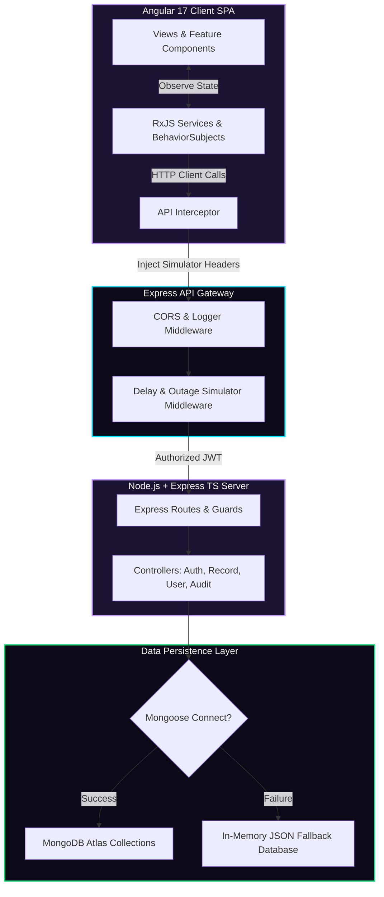
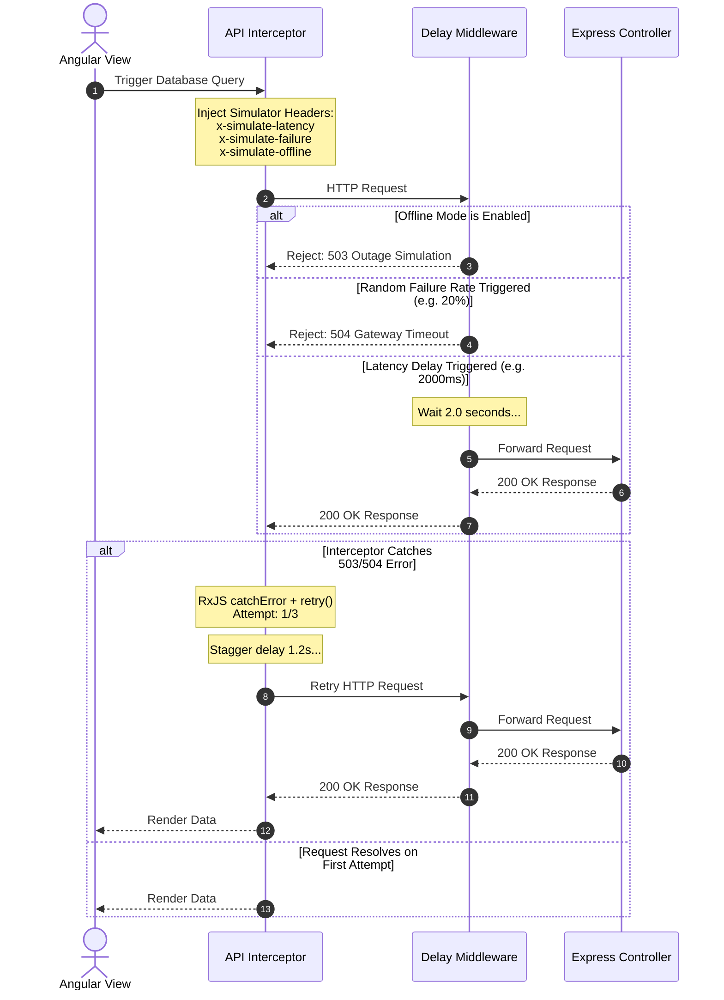
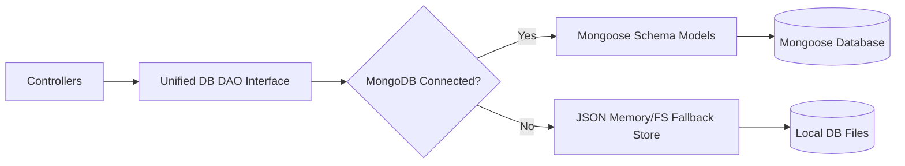

# System Architecture - VeriX

This document outlines the software design, patterns, components, and data lifecycles of the VeriX platform.

---

## 1. System Component Flowchart

The system separates client state tracking, network manipulation, and data persistence layers.



---

## 2. Verification Workflow State Machine

The **Verification Workflow Engine** drives background file reviews chronologically. Any state advance triggers audit logs, analytics modifications, and user alert cascades.

```mermaid
stateDiagram-v2
    [*] --> Created : File Initiated (Admin/User)
    Created --> Documents_Submitted : Candidate uploads metadata
    Documents_Submitted --> Background_Check : Identity & registry check
    Background_Check --> Under_Review : Risk algorithms run
    Under_Review --> Verified : Compliance verified
    Under_Review --> Created : Reset file on discrepancy

    state Created {
        [*] --> InitializeCheck
    }
    state Background_Check {
        [*] --> IdentityCheck
        --> CriminalAudit
        --> AcademicValidation
    }
```

---

## 3. Network Resilience Simulator Loop (RxJS Staggers)

Details how outgoing requests are processed under simulated instability (latency delays, outages, error drops) and how the client interceptor manages auto-retries.



---

## 4. Database Fallback Pattern

Ensures zero installation friction for the evaluator by abstracting the storage connection layer.


